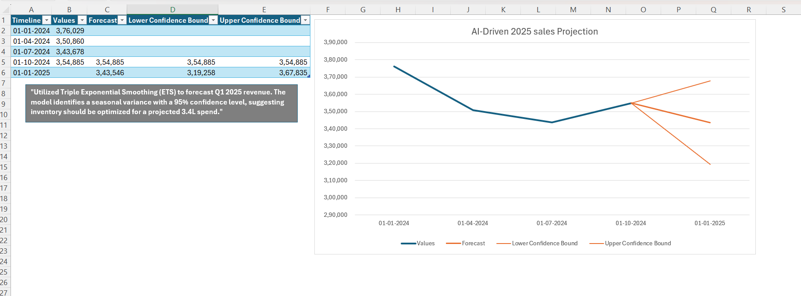

# Retail_Sales_Analysis_and_Forecasting
"End-to-end data analysis of retail sales using Excel, Power Query, and AI-driven forecasting (ETS)."
# Retail Store Sales Analysis & AI Forecasting

## 📊 Project Overview
This project involves a comprehensive analysis of retail store sales data to identify consumer behavior patterns and project future revenue. As a Statistics graduate, I focused on moving beyond descriptive charts into **Predictive Analytics**.

## 🚀 Key Features
* **ETL Pipeline:** Used Power Query to clean and transform raw Kaggle data.
* **Descriptive Analytics:** Built interactive Pivot Dashboards to track sales by Gender, Category, and Season.
* **Predictive Modeling:** Implemented an **AI Forecast** using the **Triple Exponential Smoothing (ETS)** algorithm.
* **Statistical Rigor:** Included **95% Confidence Intervals** in sales projections to account for seasonal variance.

## 🖼️ Dashboard Preview

## 📈 Insights
* Identified "Winter" and "Autumn" as peak performance seasons.
* Projected a Q1 2025 revenue trend with a specific 95% upper and lower bound for inventory planning.

## 🛠️ Tools Used
* **Excel:** Power Query, Pivot Tables, AI Forecast Sheet.
* **Statistics:** Time-series analysis, Seasonality adjustment.
